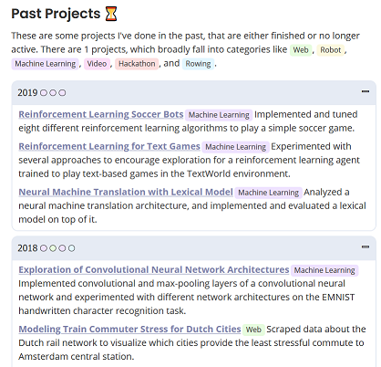
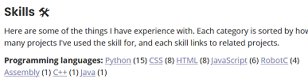
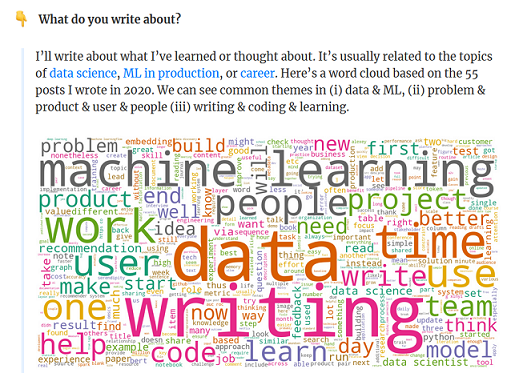
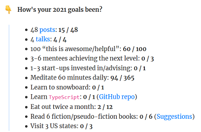
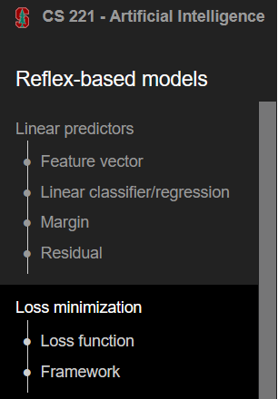

This is the start of my journey in consolidating knowledge through means of a personal website and documenting my professional journey along the way. This isn't my first attempt, and probably not my last, but I am happy and excited about this new endeavour.

Below I will outline the reasons I started this website. In addition I will provide some examples of great personal websites that have inspired me.

## Reasons and benefits of building a personal website

### Track your capstone projects
Although a website is not a project or task management tool, I do consider it useful to give an overview of the projects you are most proud of. That is why I like the website structure of Leon Overweel.

Below you can see part of his overview of past projects with nice coloured labels what the project is about. It also provides a timeline of the work he has done.

I like his section about "Skills" as well, you can click on a skill and see all the projects with regard to that skill. In my opinion it makes a skillset more tangible than when you say you have senior experience of a certain skill.

### Learn and think by writing
I believe that writing about topics or articles that interest me, stimulates me to really structure the content I read. It makes you challenge your own knowledge, and it makes you more alert to words you don't really understand. By writing content down I can consolidate and increase my understanding of a topic. Perhaps others can benefit from this shared knowledge and learnings as well.

### Building a professional resume
A personal website can be a great way to keep track and document projects and skills you've build along the way. This is tied to what I have mentioned before about "Tracking your capstone projects". It can be a canvas of who you are personally and professionally. It also allows for more flexibility than a standard pdf or word document. Definitely take a look at the section "Examples of great personal websites" where you can find some example websites that are a great reference. This does not mean that these websites are build with a professional goal in mind, but to me they provide a way to tap into a person's skills and interests, and sometimes even a glimpse of their personality.  

### Cultivating a digital garden

> A digital garden is an online space at the intersection of a notebook and a blog, where digital gardeners share seeds of thoughts to be cultivated in public. ~ Anne-Laure Le Cunff

This is a bit aligned with the topic of "Learn and think by writing". The post https://nesslabs.com/digital-garden-set-up provides a nice introduction in the meaning of a digital garden and how to build your own. It would be a whole new topic to really dive into digital gardens, but definitely check it out yourself!

## Examples of great personal websites

* [Leon Overweel](https://leonoverweel.com/): colour coded categories, great overview of current and past project, nice summary of skillsets
* [Eugene Yan](https://eugeneyan.com/): just for its resource list which links to several Github repositories where he maintains a lot of useful references related to machine learning this deserves a mention. It's not as tailored to really being a professional resume like the website of Leon Overweel, but it has a very clean, minimalist layout with a lot of great content. The FAQ section in his [about-page](https://eugeneyan.com/about/) is great as well.  With a world cloud you get the topics he writes about most:    The goals section is another nice addition:  
* [Andy Matuschak](https://notes.andymatuschak.org/About_these_notes): **THE** reference with regard to bi-directional notes or so called "digital gardens". He has inspired a lot of other digital gardens like [Azlen Elza](https://notes.azlen.me/g3tibyfv/), [Anne-Laure Le Cunff](https://www.mentalnodes.com/a-gardening-guide-for-your-mind). [Maggie Appleton](https://github.com/MaggieAppleton/digital-gardeners) has an extensive repository discussing Digital Garden tools and maintains a directory of different digital gardens and the tools to generate these websites.
* [Afshine Amidi and Shervine Amidi](https://stanford.edu/~shervine/): they have a card-like display of their projects and teaching courses. When you dive into a specific post there is a sidepanel on the left side which gives an overview of all the content in the blog post. Being able to get a good overview of the content of a page, no matter where you are on the page itself is a great advantage.  

If you know any other great resources let me know!